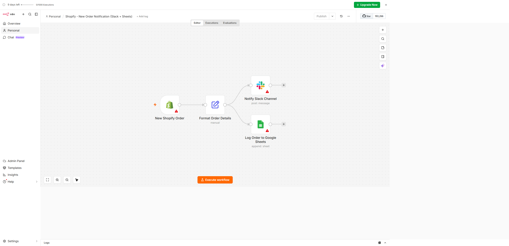
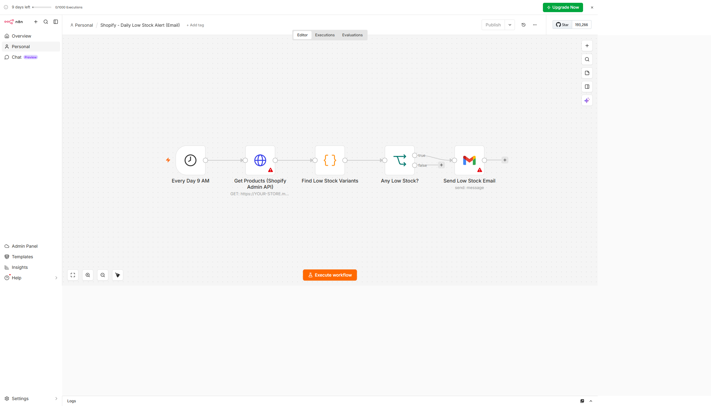
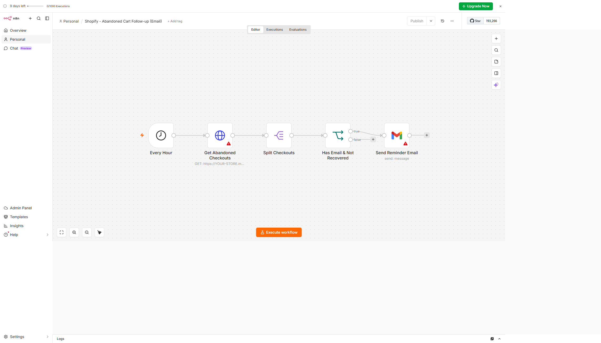

# n8n Shopify Workflows

A small collection of **ready-to-import [n8n](https://n8n.io/) automation workflows for Shopify stores**. These are the kind of automations I build to take repetitive operations off a merchant's plate — order alerts, stock monitoring, and cart recovery.

Each workflow is a self-contained `.json` file you can import straight into n8n and wire up to your own credentials.

## Workflows

### 1. New Order Notification — Slack + Google Sheets
📄 [`workflows/01-new-order-notification.json`](workflows/01-new-order-notification.json)

Fires on every new Shopify order, posts a formatted summary to a **Slack** channel, and logs the order to a **Google Sheet**.

### 2. Daily Low Stock Alert — Email
📄 [`workflows/02-low-stock-alert.json`](workflows/02-low-stock-alert.json)

Runs daily at 9 AM, pulls products from the Shopify Admin API, finds variants at or below a stock threshold, and emails an alert if anything needs restocking.

### 3. Abandoned Cart Follow-up — Email
📄 [`workflows/03-abandoned-cart-followup.json`](workflows/03-abandoned-cart-followup.json)

Runs hourly, checks for abandoned checkouts, filters out recovered/empty ones, and sends each shopper a reminder email with a link back to their cart.

## How to import

1. In n8n, open the workflows list and choose **Import from File** (top-right menu).
2. Select one of the `.json` files from the `workflows/` folder.
3. Open each node that shows a credential warning and connect **your own** credentials (Shopify, Slack, Gmail, Google Sheets).
4. Replace the placeholders before activating:
   - `YOUR-STORE.myshopify.com` → your store domain
   - `REPLACE_WITH_YOUR_CREDENTIAL_ID` → resolved automatically once you pick a credential
   - `REPLACE_WITH_YOUR_SHEET_ID` and the Slack channel ID → your own
5. Test with the **Execute Workflow** button, then toggle **Active** when you're happy.

## Notes

- Workflows ship **inactive** and contain **no secrets** — credentials are never stored in the JSON, only referenced.
- API version in the HTTP nodes is `2024-10`; bump it to a current Shopify Admin API version as needed.
- The low-stock threshold (default 5) lives in the **Find Low Stock Variants** Code node — change `THRESHOLD` to suit the store.
- These are starting points. In real projects I usually add retries, error-handling branches, and de-duplication so the same shopper isn't emailed twice.

## License

MIT — free to use and adapt.

---

Built by **Nitesh Kumawat** — Shopify & front-end developer specialising in AI-assisted eCommerce workflows.
Open to freelance / remote work: niteshkumawat911@gmail.com
